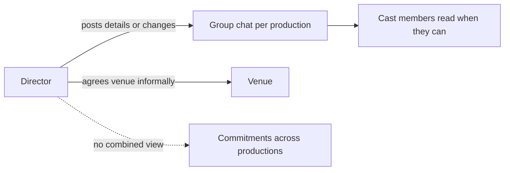

# Problem Analysis

This document analyzes the problem defined in [problem-statement.md](problem-statement.md) and derives planned requirements from it. All items are planned; nothing described here has been implemented. Details of the current workflow are inferred from the problem statement and should be validated with the theatre group where possible.

## Terminology

| Term | Meaning in this project |
|---|---|
| Production | A single theatre show being prepared by the group |
| Audition | A session in which candidates are considered for a production |
| Cast member | A person assigned to a production |
| Director | A person responsible for directing one or more productions |
| Rehearsal | A scheduled session for a production at a venue |
| Venue | A location that can host auditions or rehearsals |
| Commitment | A time-bound obligation of a person or venue, such as a rehearsal or audition |

## Problem Overview

The theatre group runs several productions in parallel. Each production needs auditions, a cast, rehearsals, and venue time. Group chats are the only coordination mechanism, and they do not scale to multiple productions. This leads to missed schedule changes, double-booked venues, and no consolidated director view.

## Current Workflow

1. A director announces audition and rehearsal details in a group chat.
2. Cast assignments are communicated and tracked informally.
3. Venues are arranged informally for each production.
4. Schedule changes are posted as new chat messages.
5. Cast members are expected to notice and act on those messages.

## Problems With the Current Workflow

| Problem | Cause in current workflow |
|---|---|
| Missed schedule changes | Changes are ordinary messages in busy chats and are not tied to the people affected. |
| Venue double-booking | No shared record of venue usage exists across productions. |
| No consolidated director view | Commitments are spread across separate conversations and personal notes. |
| Growing coordination effort | Every added production adds another stream of messages to follow. |

## Stakeholders

| Stakeholder | Interest |
|---|---|
| Directors | Reliable scheduling and visibility across productions |
| Cast members | Clear, current information about their commitments |
| Theatre group management | Smooth operation of simultaneous productions |
| Development team (Team 02) | A clearly scoped, achievable project |

## User Types

| User type | Description | Basis |
|---|---|---|
| Director | Creates and changes productions, auditions, rehearsals, and assignments; needs the consolidated view. | Stated in problem |
| Cast member | Views personal commitments and receives schedule changes. | Stated in problem |
| Auditionee | A candidate who takes part in an audition but is not yet cast. | Assumption; may be handled as a record managed by directors rather than a separate app user |

Whether a separate administrator or coordinator role is needed is an open question and is not assumed.

## User Needs and Pain Points

| User | Need | Pain point today |
|---|---|---|
| Cast member | See current rehearsal and audition details for their productions | Must search chats to find the latest information |
| Cast member | Be told when something changes | Changes are easy to overlook |
| Director | Book venues without clashes | No reliable record of what is already booked |
| Director | See all commitments across productions | Must assemble the picture manually |
| Director | Manage cast assignments per production | Assignments are tracked informally |

## Core Requirements

Requirements are derived from the problem statement. Priority indicates suitability for the initial MVP.

| ID | Requirement | Module | Priority |
|---|---|---|---|
| R1 | Users can sign in and are identified as a director or cast member. | Authentication (supporting) | Must |
| R2 | Directors can create and manage productions. | Production Management | Must |
| R3 | Directors can record auditions for a production. | Audition Management | Must |
| R4 | Directors can assign cast members to a production. | Cast Management | Must |
| R5 | Directors can schedule rehearsals for a production at a venue. | Rehearsal Scheduling | Must |
| R6 | Directors can maintain a list of venues. | Venue Management | Must |
| R7 | The system checks venue availability and prevents or flags overlapping bookings. | Venue Management | Must |
| R8 | Cast members can view their own upcoming commitments. | Schedule / Commitment Management | Must |
| R9 | Directors can view commitments across all productions in one place. | Schedule / Commitment Management | Must |
| R10 | Affected cast members are notified when a schedule they are part of changes. | Notifications | Must |
| R11 | The system flags when a person is scheduled in overlapping commitments. | Schedule / Commitment Management | Should |

R11 follows from the "consolidated view of commitments" concern but is not stated explicitly, so it is marked lower priority.

## Functional Areas

| Module | Responsibility |
|---|---|
| Production Management | Records and status of productions |
| Audition Management | Audition sessions and their details for each production |
| Cast Management | Cast members and their assignment to productions |
| Rehearsal Scheduling | Rehearsal sessions with time and venue |
| Venue Management | Venue records and availability/conflict checking |
| Schedule / Commitment Management | Combined schedule views for cast members and directors |
| Notifications | Delivering schedule change information to affected users |

## Constraints

- Student project completed within the sprint timeframe by a team of three.
- The technology stack is fixed: Flutter, Dart, Firebase Authentication, Cloud Firestore, and Firebase Cloud Messaging.
- No separate custom backend server.
- Team members do not all contribute every day, so work must be split into independent, reviewable Pull Requests.
- Scope is limited to what the problem statement supports.

## Assumptions

- The application serves a single theatre group.
- Cast members and directors have access to a device that can run the application and receive notifications.
- Directors are the users who create and change schedules.
- Venue availability is determined by the bookings recorded in the system; the system does not know about bookings made outside it.
- Users are willing to use the application in place of group chats for schedule information.

## Initial MVP Scope

The MVP (planned) covers the minimum needed to address the three core problems:

- Sign-in with director and cast member distinction (R1)
- Production, audition, cast assignment, venue, and rehearsal records (R2 to R6)
- Venue conflict checking (R7)
- Personal schedule for cast members and consolidated view for directors (R8, R9)
- Notifications on schedule change (R10)

## Out of Scope

- Ticketing, sales, or audience management
- Budgeting, payments, or finance
- Script, costume, props, or set management
- General-purpose chat or messaging between members
- Calendar integration with external services
- Support for multiple independent theatre groups
- A custom backend server

Items such as R11 (person overlap flags) are candidates for later work if time allows.

## Success Criteria

These criteria will be used to judge the MVP once developed.

| Criterion | Related problem |
|---|---|
| A rehearsal schedule change results in a notification to the cast members assigned to that production. | Missed schedule changes |
| Attempting to book a venue that is already booked for an overlapping time is prevented or clearly flagged. | Venue double-booking |
| A director can see rehearsals and auditions for all productions in a single view. | No consolidated director view |
| A cast member can see their own upcoming commitments without using group chats. | Missed schedule changes |
| Documentation and terminology remain consistent with the implemented system. | Project quality |

## Problem-to-Solution Mapping

| Problem | Planned System Response | Modules |
|---|---|---|
| Missed schedule changes | Centralized schedule and notification system | Rehearsal Scheduling, Schedule / Commitment Management, Notifications |
| Venue double-booking | Venue availability and conflict checking | Venue Management, Rehearsal Scheduling |
| No consolidated director view | Director dashboard / commitment overview | Schedule / Commitment Management, Production Management |

These responses are planned. None has been implemented.