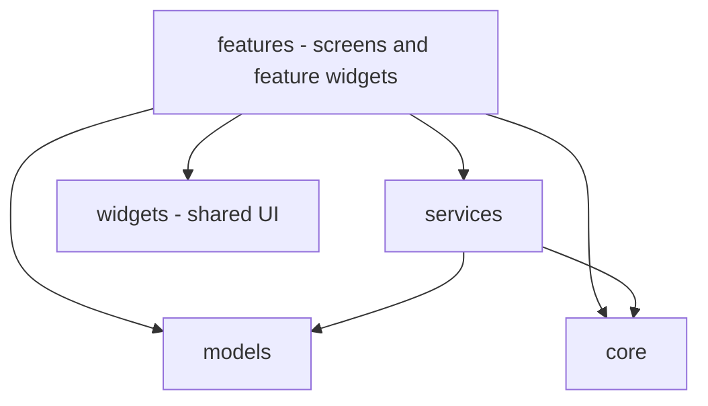

# Project Structure

This document describes the **planned** repository structure for a Flutter and Firebase application. It is a plan, not a description of existing code. At this stage the repository contains documentation only; the Flutter project has not been created. Directories will be added as they are needed, and this document should be updated if the structure changes.

## Planned Repository Layout

```text
SW2627-Theatre-Production-Manager/
│
├── lib/
│   ├── core/
│   │   ├── constants/
│   │   ├── theme/
│   │   ├── routing/
│   │   └── utils/
│   │
│   ├── models/
│   │
│   ├── services/
│   │
│   ├── features/
│   │   ├── authentication/
│   │   ├── productions/
│   │   ├── auditions/
│   │   ├── cast/
│   │   ├── rehearsals/
│   │   ├── venues/
│   │   ├── schedules/
│   │   └── notifications/
│   │
│   ├── widgets/
│   └── main.dart
│
├── test/
│
├── docs/
│   ├── problem-statement.md
│   ├── problem-analysis.md
│   └── project-structure.md
│
├── android/
├── ios/
├── web/
│
├── firebase.json
├── pubspec.yaml
├── README.md
└── .gitignore
```

## Directory Purposes

| Path | Purpose |
|---|---|
| `lib/` | All Dart source code for the application. |
| `lib/main.dart` | Application entry point. |
| `lib/core/` | Shared, non-feature-specific code: constants, theme, navigation/routing setup, and small utility helpers such as date and time formatting. |
| `lib/models/` | Plain Dart data classes for domain entities (for example production, audition, rehearsal, venue), including conversion to and from Firestore documents. |
| `lib/services/` | Classes that talk to Firebase. See "Where Firebase Code Lives" below. |
| `lib/features/` | One folder per functional area, containing that area's screens and feature-specific widgets. |
| `lib/widgets/` | Reusable UI components shared across several features. |
| `test/` | Automated Dart and Flutter tests. |
| `docs/` | Project documentation. |
| `android/`, `ios/`, `web/` | Platform folders generated by Flutter. They are edited only when platform configuration requires it. |
| `firebase.json` | Firebase project configuration file. |
| `pubspec.yaml` | Dart package manifest listing dependencies and assets. |
| `README.md` | Project overview and entry point to the documentation. |
| `.gitignore` | Files excluded from version control. |

## Feature Folders

Each folder under `lib/features/` corresponds to a planned module, plus authentication as a supporting capability.

| Folder | Corresponds to |
|---|---|
| `authentication/` | Sign-in and user session handling (Firebase Authentication) |
| `productions/` | Production Management |
| `auditions/` | Audition Management |
| `cast/` | Cast Management |
| `rehearsals/` | Rehearsal Scheduling |
| `venues/` | Venue Management |
| `schedules/` | Schedule / Commitment Management |
| `notifications/` | Notifications |

To keep the structure light, a feature folder starts with only the subfolders it needs. A typical layout is:

```text
features/rehearsals/
├── screens/     # full-page UI
└── widgets/     # UI used only by this feature
```

Additional subfolders (for example for state handling) may be added if the team agrees on an approach. No state management package has been decided at this stage.

## Where Firebase Code Lives

All direct Firebase access is planned to live in `lib/services/`, so that screens do not call Firebase APIs directly.

| Planned service | Responsibility |
|---|---|
| Authentication service | Sign-in, sign-out, and current-user access via Firebase Authentication |
| Firestore service(s) | Reading and writing Cloud Firestore data for the domain models |
| Messaging service | Receiving and handling notifications via Firebase Cloud Messaging |

Firebase initialization is planned to happen at startup in `main.dart`. Any Firebase configuration file generated by FlutterFire tooling would also be placed under `lib/`.

## Dependency Direction



Guidelines that follow from this:

- Features may use services, models, shared widgets, and core.
- Services and models must not depend on features.
- One feature should not import another feature's internals. Shared logic moves to `services/`, `models/`, or `core/`.

## Notes

- The structure is deliberately simple and suited to a small team. Layers such as separate domain and data packages are not planned.
- No custom backend directory is planned. Backend behaviour is provided by Firebase services.
- The `docs/` folder is edited through the same branch and Pull Request workflow as code (see the README).